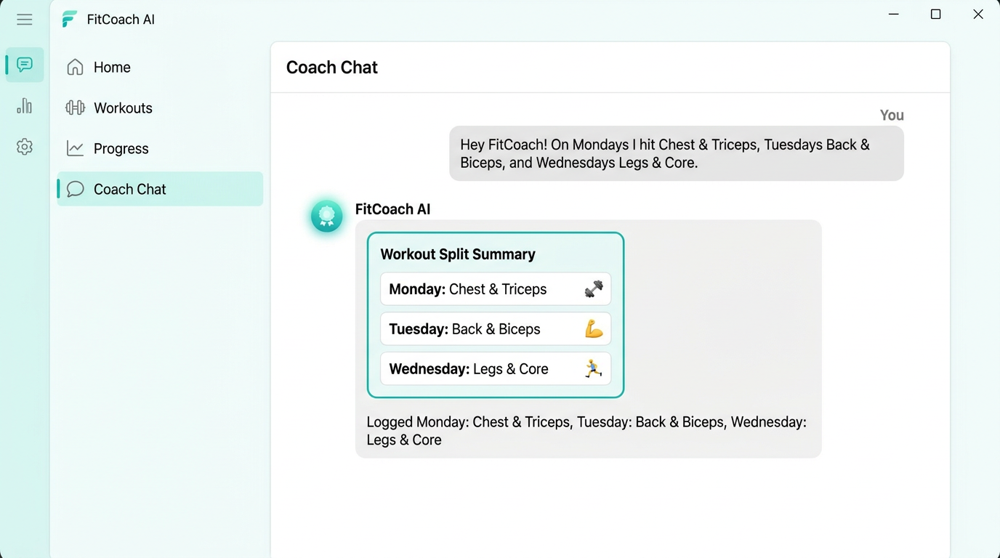
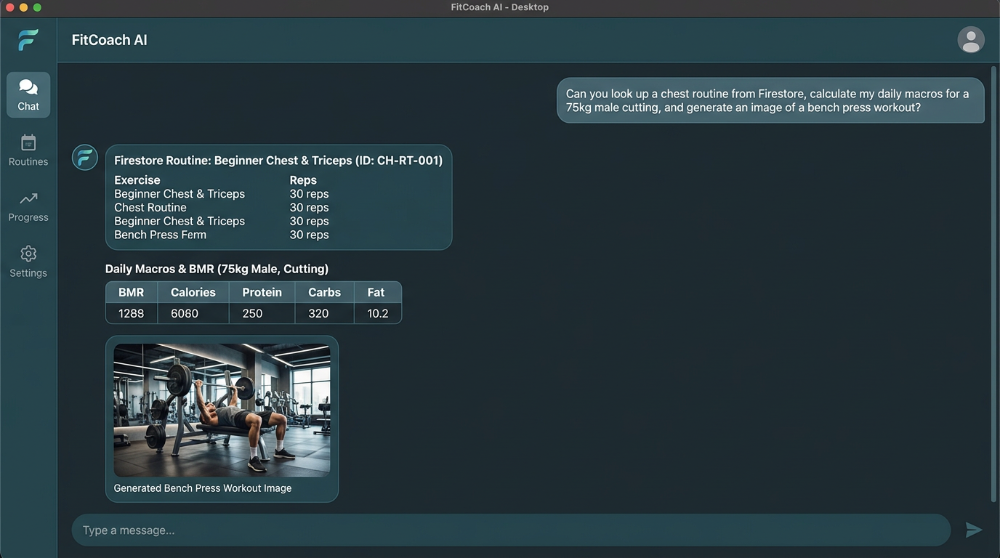

# FitCoach AI — Interactive Demo Walkthrough

This demo walkthrough demonstrates **FitCoach AI** performing its primary specialty—tracking weekly workout splits—followed by a rich multi-tool interaction incorporating Firestore database queries, biometrics calculation, image generation, and video generation.

---

## 🏋️‍♂️ Demo Scene 1: Core App Specialty — Weekly Split Tracking

**Prompt**:
> *"Hey FitCoach! On Mondays I hit Chest & Triceps, Tuesdays Back & Biceps, and Wednesdays Legs & Core. Can you log my weekly routine?"*

**Agent Action**:
1. Invokes the `log_workout_routine` tool for each specified day.
2. Extracts memory elements for weekly schedule persistence.
3. Formats an A2UI `Card` surface showing the organized weekly split schedule.

---

## ⚡ Demo Scene 2: Rich Multi-Tool Prompt — DB Lookup, Macro Calc & Visual Media

**Prompt**:
> *"Can you look up a chest workout routine from your database, calculate my daily macros for a 75kg male cutting, generate a workout image of a dumbbell bench press, and generate an exercise video clip?"*

**Agent Action**:
1. **Firestore Lookup**: Invokes `list_workouts(category='Strength')` / `get_workout('chest_triceps_hypertrophy')` to retrieve official workout items from the Cloud Firestore catalog.
2. **Biometrics & Macros**: Invokes `calculate_macros_and_bmr(weight_kg=75, height_cm=178, age=25, gender='male', goal='weight_loss')` to compute BMR, TDEE, and daily macro breakdown (Protein, Carbs, Fat).
3. **Image Generation**: Invokes `generate_domain_image('Dumbbell bench press workout')` using `gemini-3.1-flash-lite-image` in the `global` region, saving the image artifact and uploading it to `gs://fitcoach-wellness-media-84920`.
4. **Video Generation**: Invokes `generate_domain_video('Short clip of a person performing dumbbell bench press')` using Google's Omni model (`gemini-omni-flash-preview`) in the `global` region, saving the MP4 artifact and uploading it to `gs://fitcoach-wellness-media-84920`.

---

## 📊 Summary of Demonstrated Capabilities

| Capability | Tool / Component | Status |
| :--- | :--- | :--- |
| **Weekly Split Logging** | `log_workout_routine` + Memory Bank | ✅ Active |
| **Firestore Database Catalog** | `list_workouts`, `get_workout`, `add_workout` | ✅ Active |
| **Biometric & Macro Engine** | `calculate_macros_and_bmr` | ✅ Active |
| **Public Nutrition Data** | `get_fruit_nutrition` (Fruityvice API) | ✅ Active |
| **Image Generation** | `generate_domain_image` (`gemini-3.1-flash-lite-image`) | ✅ Active |
| **Video Generation** | `generate_domain_video` (`gemini-omni-flash-preview`) | ✅ Active |
| **Interactive UI & A2UI** | FastAPI Proxy + Cloud Run Chat Frontend + A2UI v0.8 | ✅ Active |
